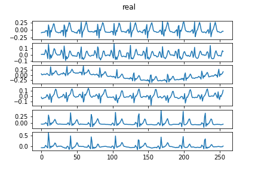

# GAN_ECG_Generator

[Google Colab link](https://colab.research.google.com/drive/1ASUpPaeP3BkkwfvdhbJmuYYoTvoIztcF?usp=sharing)

[data resized filtered](https://drive.google.com/drive/u/1/folders/1ORRFATWcmv2Dt970tkyHVUh-ZO5Aqyjl)

[data original - CINC Challange 2020](https://physionetchallenges.github.io/2020/)

code is using 1D [DCGAN](https://arxiv.org/pdf/1511.06434.pdf) with aditional convolutions and skip conections and [WGAN -GP](https://arxiv.org/abs/1704.00028)

## training gif

